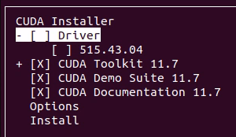
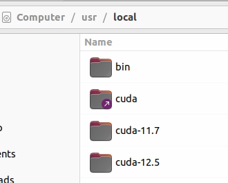

# Setting Up CUDA on Ubuntu 22.04

## Overview

CUDA (Compute Unified Device Architecture) is a parallel computing platform and programming model developed by NVIDIA for general computing on its own GPUs (Graphics Processing Units). Setting up CUDA can significantly speed up the performance of AI and deep learning applications. This guide will walk you through the steps to install and configure CUDA on Ubuntu 22.04.

Note: This wiki has been verified on **GeForce RTX 4090** and **GeForce GTX 1080 Ti**. You may find the  [NVIDIA CUDA GPUs list](https://developer.nvidia.com/cuda-gpus) helpful for checking compatibility with other GPU models.

## Table of Contents

- [Install Driver](#install-driver)
- [Download CUDA Toolkit](#download-cuda-toolkit)
- [Install CUDA Toolkit](#install-cuda-toolkit)
- [Switching Between CUDA Versions](#switching-between-cuda-versions)
- [Verify Installation](#verify-installation)
- [Troubleshooting](#troubleshooting)
- [Resources](#resources)
- [Optional Information](#optional-information)

## Install NVIDIA Driver
Ensure you have the correct NVIDIA driver installed for your GPU model. Note that the driver provided on the [NVIDIA Driver Downloads](https://www.nvidia.com/Download/index.aspx) page might not be compatible with CUDA. Therefore, it is recommended to follow the steps below for installing the driver:

- GeForce RTX 4090
    ```bash
    sudo apt install nvidia-driver-535
    ```
- GeForce GTX 1080 Ti
    ```bash
    sudo apt install nvidia-driver-470
    ```
## Download CUDA Toolkit
Go to the [NVIDIA CUDA Toolkit download page](https://developer.nvidia.com/cuda-downloads?target_os=Linux&target_arch=x86_64&Distribution=Ubuntu&target_version=22.04&target_type=runfile_local), and download the `runfile (local)` installer package for Ubuntu 22.04, do not use `deb (local)` installer, because it very easy install the wrong version, and even worse, it can mess up the currently installed GPU driver.

This step only needs to be performed once, as the installer is a large file.
- **[12.5](https://developer.nvidia.com/cuda-downloads?target_os=Linux&target_arch=x86_64&Distribution=Ubuntu&target_version=22.04&target_type=runfile_local)**
    ```
    wget https://developer.download.nvidia.com/compute/cuda/12.5.0/local_installers/cuda_12.5.0_555.42.02_linux.run
    ```
- **[11.8](https://developer.nvidia.com/cuda-11-8-0-download-archive?target_os=Linux&target_arch=x86_64&Distribution=Ubuntu&target_version=22.04&target_type=runfile_local)**
    ```
    wget https://developer.download.nvidia.com/compute/cuda/11.8.0/local_installers/cuda_11.8.0_520.61.05_linux.run
    ```

- **[11.7](https://developer.nvidia.com/cuda-11-7-0-download-archive?target_os=Linux&target_arch=x86_64&Distribution=Ubuntu&target_version=22.04&target_type=runfile_local)**
    ```
    wget https://developer.download.nvidia.com/compute/cuda/11.7.0/local_installers/cuda_11.7.0_515.43.04_linux.run
    ```

## Install CUDA Toolkit

1. **Make the downloaded file executable:**
    ```bash
    chmod +x cuda_*.run
    ```
1. **Run the Installer .run file**

    - **12.5**:
        ```bash
        sudo sh cuda_12.5.0_555.42.02_linux.run
        ```
    - **11.8**
        ```
        Sudo sh cuda_11.8.0_520.61.05_linux.run
        ```
    - **11.7**:
        ```
        sudo sh cuda_11.7.0_515.43.04_linux.run
        ```
1. **Follow the prompts to complete the installation.** to complete the installation. Please be aware that it may take a considerable amount of time for these instructions to appear, so your patience is appreciated. When prompted, type `accept` to agree to the license agreement and then select the components you wish to install.

    <mark>Important</mark>: Uncheck the option to install the NVIDIA driver. This step is crucial to prevent potential conflicts between existing drivers and the one included in the CUDA package.

    
1. **Reboot Your System**:
   ```bash
   sudo reboot
   ```

If you encounter any driver compatibility issues during or after the installation, you can resolve these issues separately by using the **Cleaning Up NVIDIA Drivers and CUDA** instruction. Once resolved, you may re-execute the .run file as many times as needed without affecting the previously installed components. This flexibility allows you to manage and update your CUDA installation efficiently.

## Switching Between CUDA Versions

When working with multiple versions of CUDA on your system, you might need to switch between them for compatibility with different software or projects. The `update-alternatives` tool in Ubuntu provides a convenient way to manage and switch between different versions of CUDA. Here are the steps to set up and switch between different CUDA versions:

1. **Locate Installed CUDA Versions**

   First, ensure that you have the desired CUDA versions installed on your system. Each version should be installed in a separate directory under `/usr/local/`, such as `/usr/local/cuda-12.5`, `/usr/local/cuda-11.7`, and `/usr/local/cuda-11.8`.
   

2. **Add CUDA Versions to Alternatives System**

   Use the `update-alternatives` command to add each CUDA version to the alternatives system. This step will assign priorities to each version, which will help in switching between them later. Run the following commands:

   ```bash
   sudo update-alternatives --install /usr/local/cuda cuda /usr/local/cuda-12.5 100
   sudo update-alternatives --install /usr/local/cuda cuda /usr/local/cuda-11.7 90
   sudo update-alternatives --install /usr/local/cuda cuda /usr/local/cuda-11.8 80
   ```

   - The first argument `/usr/local/cuda` is the symbolic link that will be managed by `update-alternatives`.
   - The second argument `cuda` is the name of the alternative.
   - The third argument is the path to the specific CUDA version.
   - The final argument is the priority. Higher values indicate higher priority. 

3. **Select the Desired CUDA Version**

   Once the versions are added, you can select the desired CUDA version using the `update-alternatives --config` command:

   ```bash
   sudo update-alternatives --config cuda
   ```

   This command will display a list of installed CUDA versions along with their selection numbers and paths. You can select the desired version by entering its corresponding number.

   Example output:

   ```plaintext
   There are 3 choices for the alternative cuda (providing /usr/local/cuda).

     Selection    Path                    Priority   Status
   ------------------------------------------------------------
   * 0            /usr/local/cuda-12.5     100       auto mode
     1            /usr/local/cuda-11.7     90        manual mode
     2            /usr/local/cuda-11.8     80        manual mode
     3            /usr/local/cuda-12.5     100       manual mode

   Press <enter> to keep the current choice[*], or type selection number: 
   ```

   Type the selection number of the desired CUDA version and press Enter.

## Verify Installation

After selecting the desired CUDA version, you can verify that the change was successful by running:
1. `nvcc --version`

    This command should display the version of the CUDA toolkit that is currently active.
    ```bash
    nvcc: NVIDIA (R) Cuda compiler driver
    Copyright (c) 2005-2022 NVIDIA Corporation
    Built on Tue_May__3_18:49:52_PDT_2022
    Cuda compilation tools, release 11.7, V11.7.64
    Build cuda_11.7.r11.7/compiler.31294372_0

    ```


2. `nvidia-smi`
    This command outputs a summary of the current status of all GPUs, including utilization, temperature, and memory usage.

    <mark>Important</mark> The `CUDA Version` displayed by `nvidia-smi` is tied to the installed NVIDIA driver and does not change when you switch between different CUDA toolkit installations. To ensure you are using the correct CUDA version for your applications, update your environment variables and verify the active CUDA version with `nvcc --version`.
    ```
    Thu Jun  6 16:14:47 2024       
    +---------------------------------------------------------------------------------------+
    | NVIDIA-SMI 535.171.04             Driver Version: 535.171.04   CUDA Version: 12.2     |
    |-----------------------------------------+----------------------+----------------------+
    | GPU  Name                 Persistence-M | Bus-Id        Disp.A | Volatile Uncorr. ECC |
    | Fan  Temp   Perf          Pwr:Usage/Cap |         Memory-Usage | GPU-Util  Compute M. |
    |                                         |                      |               MIG M. |
    |=========================================+======================+======================|
    |   0  NVIDIA GeForce RTX 4090        Off | 00000000:01:00.0  On |                  Off |
    |  0%   57C    P2              70W / 450W |   1102MiB / 24564MiB |      0%      Default |
    |                                         |                      |                  N/A |
    +-----------------------------------------+----------------------+----------------------+
                                                                                            
    +---------------------------------------------------------------------------------------+
    | Processes:                                                                            |
    |  GPU   GI   CI        PID   Type   Process name                            GPU Memory |
    |        ID   ID                                                             Usage      |
    |=======================================================================================|
    |    0   N/A  N/A      2210      G   /usr/lib/xorg/Xorg                          152MiB |
    |    0   N/A  N/A      2355      G   /usr/bin/gnome-shell                         91MiB |
    |    0   N/A  N/A      5123      G   ...irefox/4336/usr/lib/firefox/firefox      311MiB |
    |    0   N/A  N/A     44088    C+G   ...libexec/gnome-remote-desktop-daemon      510MiB |
    |    0   N/A  N/A     61412      G   gnome-control-center                          6MiB |
    +---------------------------------------------------------------------------------------+
    ```

1. Run deviceQuery
   ```bash
   /usr/local/cuda/extras/demo_suite/deviceQuery
   ```


## Resources

- [NVIDIA CUDA Toolkit Documentation](https://docs.nvidia.com/cuda/)
- [CUDA Programming Guide](https://docs.nvidia.com/cuda/cuda-c-programming-guide/index.html)
- [NVIDIA Developer Forums](https://forums.developer.nvidia.com/)

## Troubleshooting
### Cleaning Up NVIDIA Drivers and CUDA
Cleaning up NVIDIA drivers and CUDA from an Ubuntu system can be necessary for various reasons, such as troubleshooting issues, upgrading to newer versions, or reverting to older versions. This guide provides step-by-step instructions to ensure a clean removal of NVIDIA drivers and CUDA toolkit from your Ubuntu system.
1. Clean up
    ```
    sudo apt-get purge '^nvidia-.*'
    sudo apt-get remove --purge '^cuda-.*'
    sudo apt-get purge cuda
    sudo apt-get purge libcudnn*
    sudo apt-get autoremove
    sudo apt-get autoclean
    sudo add-apt-repository --remove ppa:graphics-drivers/ppa
    sudo rm -rf /usr/local/cuda
    ``` 
1. Reboot
    ```
    sudo reboot
    ```

## Optional Information
### Set Environment Variables instead of using `update-alternatives`

1. **Edit the `.bashrc` File**:
   ```bash
   nano ~/.bashrc
   ```

2. **Add the Following Lines**:
   ```bash
   export PATH=/usr/local/cuda-11.7/bin${PATH:+:${PATH}}
   export LD_LIBRARY_PATH=/usr/local/cuda-11.7/lib64${LD_LIBRARY_PATH:+:${LD_LIBRARY_PATH}}
   ```

3. **Source the `.bashrc` File**:
   ```bash
   source ~/.bashrc
   ```

### CUDA C file for testing
Here's a simple CUDA C file (`test.cu`) that you can use to test your CUDA setup. This file contains a basic kernel that performs element-wise addition of two arrays.

### `test.cu`

```cpp
#include <iostream>
#include <cuda_runtime.h>

// CUDA kernel function to add the elements of two arrays
__global__ void add(int n, float *x, float *y) {
    int index = blockIdx.x * blockDim.x + threadIdx.x;
    int stride = blockDim.x * gridDim.x;
    for (int i = index; i < n; i += stride) {
        y[i] = x[i] + y[i];
    }
}

int main(void) {
    int N = 1<<20; // 1 million elements

    // Allocate unified memory – accessible from CPU or GPU
    float *x, *y;
    cudaMallocManaged(&x, N * sizeof(float));
    cudaMallocManaged(&y, N * sizeof(float));

    // Initialize x and y arrays on the host
    for (int i = 0; i < N; i++) {
        x[i] = 1.0f;
        y[i] = 2.0f;
    }

    // Run kernel on 1M elements on the GPU
    int blockSize = 256;
    int numBlocks = (N + blockSize - 1) / blockSize;
    add<<<numBlocks, blockSize>>>(N, x, y);

    // Wait for GPU to finish before accessing on host
    cudaDeviceSynchronize();

    // Check for errors (all values should be 3.0f)
    float maxError = 0.0f;
    for (int i = 0; i < N; i++) {
        maxError = fmax(maxError, fabs(y[i] - 3.0f));
    }
    std::cout << "Max error: " << maxError << std::endl;

    // Free memory
    cudaFree(x);
    cudaFree(y);

    return 0;
}
```

### Instructions to Compile and Run

1. Save the code to a file named `test.cu`.
2. Open a terminal and navigate to the directory where `test.cu` is saved.
3. Compile the file using the NVIDIA CUDA compiler (`nvcc`):
   ```sh
   nvcc -o test test.cu
   ```
4. Run the compiled program:
   ```sh
   ./test
   ```

### Expected Output

If everything is set up correctly, you should see an output similar to:
```sh
Max error: 0
```

This indicates that the element-wise addition was performed correctly on the GPU.